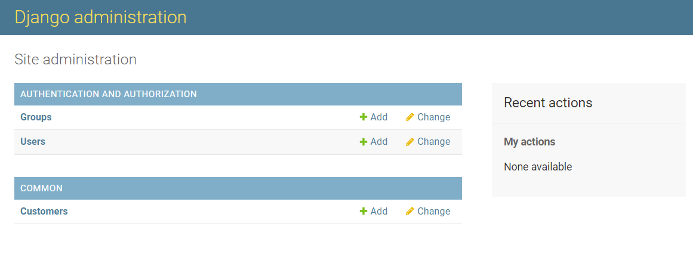

## Django Admin 管理数据

> Django提供了一个管理员操作界面可以方便的 添加、修改、删除你定义的 model 表数据。
>
> 首先，我们需要创建 一个超级管理员账号。
> 
> 进入到项目的根目录，执行如下命令，依次输入你要创建的管理员的 登录名、email、密码。
>
> python manage.py createsuperuser
> 
> Username (leave blank to use 'haiji'): haiji
> 
> Email address: haiji@163.com
> 
> Password:
> 
> Password (again):
> 
> Superuser created successfully.
> 然后我们需要修改应用里面的 管理员 配置文件 common/admin.py，注册我们定义的model类。这样Django才会知道

```python
from django.contrib import admin

from .models import Customer

admin.site.register(Customer)
```

启动项目,访问 `http://127.0.0.1:8000/admin/` 账户与密码就是我们刚刚创建的


